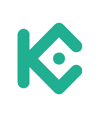

```{r, include = FALSE}
knitr::opts_chunk$set(
    warning = FALSE,
    message = FALSE,
    fig.path = "man/figures/README-",
    fig.align = "center",
    out.width = "100%",
    collapse = TRUE,
    comment = "#>"
)

options("datatable.print.topn" = 3, "datatable.print.nrows" = 50, "datatable.print.class" = TRUE, "datatable.print.trunc.cols" = TRUE)
```

# kucoin 

<!-- badges: start -->
[](https://www.tidyverse.org/lifecycle/#experimental)
[](https://travis-ci.org/dereckmezquita/kucoin)
<!-- badges: end -->

## Installation

You can install the development version of `kucoin` using:

```{r, eval=FALSE}
# install.packages("remotes")
remotes::install_github("dereckmezquita/kucoin")
```

## Getting Started

### API Authorisation

Some functions in this package require permissioned access and need a proper API key, secret, and passphrase. If you don't have a key, or need more information, visit the [Generating an API Key](https://docs.kucoin.com/#generating-an-api-key){target="_blank}.

#### Setting-up API Key

Use an `.Renviron` file to set your API key. In the `.Renviron` file, insert your API key details as follow:

```bash
# sandbox has been deprecated see kucoin documentation for more information
KC-API-ENDPOINT = "https://api.kucoin.com"

KC-API-KEY = XXXXXXXXXX
KC-API-SECRET = XXXXXXXXXX
KC-API-PASSPHRASE = XXXXXXXXXX
```

